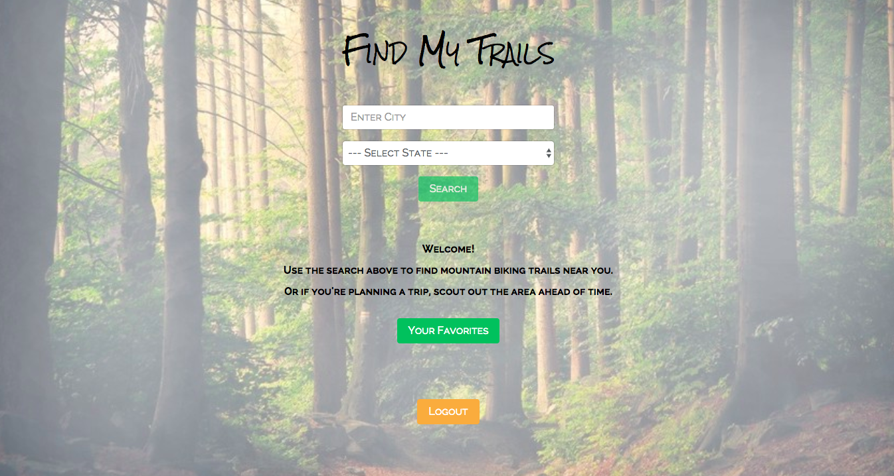

# FindMyTrails.com

----

### <a href="https://www.findmytrails.com/#/" target="_blank">Live App</a>

> This app will allow you to enter a location by city and state and will return a list of mountain biking trails in that specific area. Each trail will include the trail name, trail distance, trail description and directions. The trail name is also a link to a webpage for that specific trail which contains more detailed information.

----
### Screenshot

----
### Technology
* **ReactJS**
* **Redux**
* **React Router**
* **NodeJS**
* **MongoDB**
* **Mongoose**
* **Express**
* **Passport**
* **Bootstrap**

----
### App Features
* Google Authentication/Login
* Search By City/State
* Return List of MTB Trails with Trail Info
* Ability to add trails as favorites
* User trail favorites saved to MongoDB
